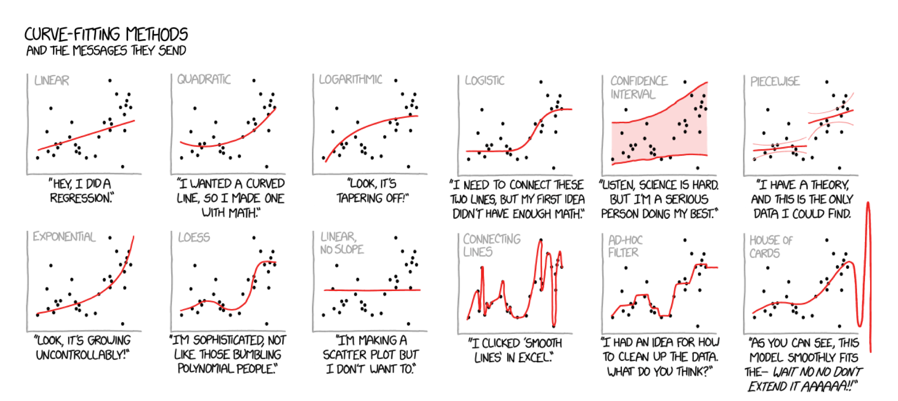

```{r setup, echo = FALSE}
knitr::opts_chunk$set(comment = NA, 
                      fig.width = 6, 
                      fig.height = 6,
                      fig.align = 'center',
                      echo = TRUE, 
                      eval = TRUE, 
                      warning = FALSE,
                      message = FALSE)

options(digits = 3)
```

<p align="center">
<br>
<font style="font-size:10px">adapted from [xkcd.com](https://xkcd.com/)</font>
</p>

# {.tabset}

## Overview

In this practical, you'll practice the basics of fitting and exploring regression models in R.

By the end of this practical you will know how to:

1. Fit a regression model to training data.
2. Explore your fit object with generic functions.
3. Evaluate the model's fitting performance using accuracy measures such as MSE and MAE.
4. Explore the effects of adding additional features.


## Tasks

### A - Setup

1. Open your `TheRBootcamp` R project. 

```{r}
# Done!
```

2. Open a new R script. At the top of the script, using comments, write your name and the date. Save it as a new file called `Fitting_practical.R` in the `2_Code` folder.  

```{r, eval = FALSE, echo = TRUE}
## NAME
## DATE
## Fitting practical
```

3. Using `library()`, load the packages `tidyverse` and `caret`.

```{r, echo = TRUE, eval = TRUE}
# Load packages necessary for this practical
library(tidyverse)
library(caret)
```

4. In this practical, you'll analyze a dataset of 388 U.S. Colleges. The data is stored in `college_train.csv`. Using the following template, load the dataset into R as `college_train`.

```{r, echo = TRUE, eval = FALSE}
# Load in college_train.csv data as college_train
college_train <- read_csv(file = "1_Data/college_train.csv")
```

```{r, eval = TRUE}
college_train <- read_csv(file = "1_Data/college_train.csv")
```

5. Take a look at the first few rows of the dataset by printing it to the console. Pay attention to the feature types, the number of features and the number of cases. 

```{r}
college_train
```

6. Before starting to model the data, you need to do a little bit of data cleaning: Convert all character columns to factors using the following code.

```{r, echo = TRUE}
# Convert character to factor
college_train <- college_train %>%
          mutate_if(is.character, factor)
```

### B - Determine sampling procedure

1. In `caret`, the computational nuances of training a model are defined using the `trainControl()` function. As this session focuses on the basics of fitting, set `method = "none"` for now and save the resulting object as `ctrl_none`. 

```{r echo = TRUE}
# Set training resampling method to "none"
ctrl_none <- trainControl(method = "none") 
```

### C - Fit a regression model

1. Using the code below, fit a regression model predicting graduation rate (`Grad.Rate`) as a function of one feature, namely `PhD` (percent of faculty with PhDs). Save the result as an object `graduation_glm`. Specifically:

- set the `form` argument to `Grad.Rate ~ PhD`.
- set the `data` argument to your training data `college_train`.
- set the `method` argument to `"glm"` for regression.
- set the `trControl` argument to `ctrl_none`, the object you created above

```{r, echo = TRUE, eval = FALSE}
# graduation_glm: Regression Model
graduation_glm <- train(form = XX ~ XX,
                        data = XX,
                        method = "XX",
                        trControl = XX)
```


```{r}
# graduation_glm: Regression Model
graduation_glm <- train(form = Grad.Rate ~ PhD,
                        data = college_train,
                        method = "glm",
                        trControl = ctrl_none)
```

2. Explore the fitted model using the `summary()` function, by setting the function's first argument to `graduation_glm`. How do you interpret the output including the estimated parameters?

```{r, echo = TRUE, eval = FALSE}
# Show summary information from the regression model
summary(XXX)
```

```{r}
# Show summary information from the regression model
summary(graduation_glm)
```

3. Save the model's fitted values. Do this by running the following code, which saves the fitted values as `glm_fit`.

```{r, echo = TRUE, eval = FALSE}
# Get fitted values from the graduation_glm
glm_fit <- predict(XXX)
```

```{r}
# Get fitted values from the model
glm_fit <- predict(graduation_glm)
```

### D - Evaluate performance

1. Evaluate the model's performance by comparing the fitted values of your model to the true values. Start by defining the vector `criterion` as the true graduation rates in the data.

```{r, echo = TRUE, eval = TRUE}
# Define criterion as Grad.Rate
criterion <- college_train$Grad.Rate
```

2. Now quantify the model's performance using `postResample()`, with the fitted values as the prediction, and the criterion as the observed values.

Specifically:

- set the `pred` argument to `glm_fit` (the fitted values).
- set the `obs` argument to `criterion` (the criterion values).

```{r, echo = TRUE, eval = FALSE}
# Model performance
postResample(pred = XXX,   
             obs = XXX) 
```

```{r}
# Regression Fitting Accuracy
postResample(pred = glm_fit,  
             obs = criterion) 
```

3. The output of `postResample()` shows three values, *RMSE*, *Rsquared* und *MAE*. How do you interpret these; is the performance good or bad?

```{r}
# On average, the model fits are 12.8633 away from the true values.
#  Whether this is 'good' or not depends on you :)
```


### E - Add more features

So far you have only used one feature (`PhD`), to predict `Grad.Rate`. Try again, but now use a total of three features, namely: 

- `PhD` - the percent of faculty with a PhD.
- `Room.Board` - room and board costs.
- `S.F.Ratio` - student to faculty ratio.

1. Using the same steps as above, create a regression model `graduation_glm_three` which predicts `Grad.Rate` using the three features. Specifically,...

- set the `form` argument to `Grad.Rate ~ PhD + Room.Board + S.F.Ratio`.
- set the `data` argument to your training data `college_train`.
- set the `method` argument to `"glm"` for regression.
- set the `trControl` argument to `ctrl_none`.

```{r, echo = TRUE, eval = FALSE}
# graduation_glm_three: Regression Model
graduation_glm_three <- train(form = XXX ~ XXX + XXX + XXX + XXX,
                              data = XXX,
                              method = "XXX",
                              trControl = XXX)
```

```{r}
# graduation_glm_three: Regression Model
graduation_glm_three <- train(form = Grad.Rate ~ PhD + Room.Board + S.F.Ratio,
                              data = college_train,
                              method = "glm",
                              trControl = ctrl_none)
```

2. Explore your model using `summary()`. What values were estimated for the parameters?

```{r, echo = TRUE, eval = FALSE}
summary(XXX)
```

```{r}
summary(graduation_glm_three)
```

3. Extract the fitted values of this new model using `predict()` and save them as a new object `glm_fit_three`.

```{r, echo = TRUE, eval = FALSE}
# Save new model fits
glm_fit_three <- predict(XXX)
```

```{r}
# Save new model fits
glm_fit_three <- predict(graduation_glm_three)
```

4. Use `postResample()` to evaluate the performance of the model with three predictors. How well does the new model fit the data, relative to the one using only one predictor. 

```{r, echo = TRUE, eval = FALSE}
# New model fitting accuracy
postResample(pred = XXX,   # Fitted values 
             obs = XXX)    # criterion values
```

```{r}
# New model fitting accuracy
postResample(pred = glm_fit_three,   # Fitted values 
             obs = criterion)        # criterion values
```

```{r}
# The new MAE value is 11.779, it's better (smaller) than the previous model, but still not great (in my opinion)
```

### F - Use all features

1. Alright, now it's time to use all features available. Using the same steps as above, create a regression model `graduation_glm_all` which predicts `Grad.Rate` using *all* features in the dataset. Specifically:

- set the `form` argument to `Grad.Rate ~ .`.
- set the `data` argument to the training data `college_train`.
- set the `method` argument to `"glm"` for regression.
- set the `trControl` argument to `ctrl_none`.

```{r, echo = TRUE, eval = FALSE}
# graduation_glm_all: Regression Model
graduation_glm_all <- train(form = XXX ~ .,
                            data = XXX,
                            method = "glm",
                            trControl = XXX)
```

```{r}
# graduation_glm_all: Regression Model
graduation_glm_all <- train(form = Grad.Rate ~ .,
                            data = college_train,
                            method = "glm",
                            trControl = ctrl_none)
```

2. Explore your model using `summary()`. What do the parameter estimates tell you?

```{r, echo = TRUE, eval = FALSE}
summary(XXX)
```

```{r}
summary(graduation_glm_all)
```

3. Save the model's fitted values as a new object `glm_fit_all`.

```{r, echo = TRUE, eval = FALSE}
# Save new model fits
glm_fit_all <- predict(XXX)
```

```{r}
# Save new model fits
glm_fit_all <- predict(graduation_glm_all)
```

4. Use `postResample()` to evaluate the performance of the model with all predictors. Compare it to the previous two models with fewer predictors. Do you detect a pattern?

```{r}

# New model fitting accuracy
postResample(pred = glm_fit_all,   # Fitted values 
             obs = criterion)      # criterion values
```

### G - Factor as criterion

Now it's time to do a classification task! Recall that in classification tasks, your are predicting a `factor`. In this task, you will predict whether or not a college is Private or Public, which is stored in the feature `Private`.

1. Use `calss()` to make sure that the `Private` is stores as a factor. If the output is `factor`, you can proceed.

```{r, echo = TRUE}
# Look at the class of the feature Private
class(college_train$Private)
```

2. Now, save the feature `Private` as a new object called `criterion`.

```{r, echo = TRUE}
# Define criterion as college_train$Private
criterion <- college_train$Private
```

### H - Fit a classification model

1. Using `train()`, create a logistic regression model called `private_glm` predicting the criterion `Private` using all other features. Specifically,...

- set the `form` argument to `Private ~ .`.
- set the `data` argument to the training data `college_train`.
- set the `method` argument to `"glm"`.
- set the `trControl` argument to `ctrl_none`.

```{r, echo = TRUE, eval = FALSE}
# Fit regression model predicting Private
private_glm <- train(form = XXX ~ .,
                     data = XXX,
                     method = "XXX",
                     trControl = XXX)
```


```{r}
# Fit regression model predicting private
private_glm <- train(form = Private ~ .,
                     data = college_train,
                     method = "glm",
                     trControl = ctrl_none)
```

2. Explore the `private_glm` object using the `summary()` function. What to you make of the estimates?

```{r, echo = TRUE, eval = FALSE}
# Explore the private_glm object
summary(XXX)
```

```{r}
# Explore the private_glm object
summary(private_glm)
```

3. Now extract the fitted values `glm_fit` using the following code.

```{r, echo = TRUE, eval = FALSE}
# Get fitted values 
glm_fit <- predict(XXX)
```

```{r}
# Get fitted values 
glm_fit <- predict(private_glm)
```

4.Use `confusionMatrix() to evaluate the performance of your classification model. Specifically:

- set the `data` argument to your `glm_fit` values.
- set the `reference` argument to the `criterion` values.

```{r, eval = FALSE, echo = TRUE}
# Evaluate model performance
confusionMatrix(data = XXX,      # This is the prediction!
                reference = XXX) # This is the truth!
```


```{r}
# Evaluate model performance
confusionMatrix(data = glm_fit,        # This is the prediction!
                reference = criterion) # This is the truth!
```

5. Look at the results, what is the overall accuracy of the model? How do you interpret this?

```{r}
# The overall accuracy is 0.942. Across all cases, the model fits the true class values 94.2% of the time.
```

### I - Fit a classification model pt. 2 

1. Refit the classification model using fewer features. 

2. How does using fewer features affect the model's performance?

### X - Challenges

1. Conduct a regression analysis predicting the percent of alumni who donate to the college (`perc.alumni`). How good can your regression model fit this criterion? Which features contribute most?

```{r}
mod <- train(form = perc.alumni ~ .,
             data = college_train,
             method = "glm",
             trControl = ctrl_none)

summary(mod)
mod_predictions <- predict(mod)
hist(mod_predictions)
postResample(pred = mod_predictions,
             obs = college_train$perc.alumni)

```

2. Conduct a classification analysis predicting whether or not a school is 'hot' -- where a 'hot' school is one that receives at least 10,000 applications. Use the code below to first create the `hot` variable.

```{r, echo = TRUE}
# Add a new factor criterion 'hot' which indicates whether or not a schol receives at least 10,000 applications
college_train <- college_train %>%
  mutate(hot = factor(Apps >= 10000))
```

```{r}
mod_hot <- train(form = hot ~ ., 
                 data = college_train,
                 method = "glm",
                 trControl = ctrl_none)

summary(mod_hot)
mod_predictions <- predict(mod_hot)
plot(mod_predictions)
confusionMatrix(data = mod_predictions,        # This is the prediction!
                reference = college_train$hot) # This is the truth!

```

3. Did you notice anything strange in your model when doing the previous task? If you used all available predictors you will have gotten a warning that your model did not converge. That can happen if the maximum number of iterations (glm uses an iterative procedure when fitting the model) is reached. The default is a maximum of 25 iterations, see `?glm.control`. To fix it just add the following code in your `train()` function `control = list(maxit = 75)`, and run it again.

```{r}
mod_hot <- train(form = hot ~ ., 
                 data = college_train,
                 method = "glm",
                 trControl = ctrl_none,
                 control = list(maxit = 75))

summary(mod_hot)
mod_predictions <- predict(mod_hot)
plot(mod_predictions)
confusionMatrix(data = mod_predictions,        # This is the prediction!
                reference = college_train$hot) # This is the truth!

```

4. Now the model should have converged, but there is still another warning occurring: `glm.fit: fitted probabilities numerically 0 or 1 occurred`. This can happen if very strong predictors occur in the dataset (see [Venables & Ripley, 2002](http://www.bagualu.net/wordpress/wp-content/uploads/2015/10/Modern_Applied_Statistics_With_S.pdf), p. 197). If you added all predictors (except again the college names), then this problem occurs because the `Apps` variable, used to create the criterion, was also part of the predictors (plus some other variables that highly correlate with `Apps`). Check the variable correlations (the code below will give you a matrix of bivariate correlations). You will learn an easier way of checking the correlations of variables in a later session.

```{r, eval = FALSE, echo = TRUE}
# get correlation matrix of numeric variables
cor(college_train[,sapply(college_train, is.numeric)])
```


5. Now fit the model again but only select variables that are not directly related to the number of applications (here several solutions are possible, there is no clear-cut criterion about which variables to include and which to discard).

```{r}
mod_hot <- train(form = hot ~ . - Apps -Enroll -Accept - F.Undergrad,
                 data = college_train,
                 method = "glm",
                 trControl = ctrl_none,
                 control = list(maxit = 75))

summary(mod_hot)
mod_predictions <- predict(mod_hot)
plot(mod_predictions)
confusionMatrix(data = mod_predictions,        # This is the prediction!
                reference = college_train$hot) # This is the truth!

```


## Examples

```{r, eval = FALSE, echo = TRUE}
# Fitting and evaluating a regression model ------------------------------------

# Step 0: Load packages-----------
library(tidyverse)    # Load tidyverse for dplyr and tidyr
library(caret)        # For ML mastery 

# Step 1: Load and Clean, and Explore Training data ----------------------

# I'll use the mpg dataset from the dplyr package in this example
#  no need to load an external dataset
data_train <- read_csv("1_Data/mpg_train.csv")

# Convert all characters to factor
#  Some ML models require factors
data_train <- data_train %>%
  mutate_if(is.character, factor)

# Explore training data
data_train        # Print the dataset
View(data_train)  # Open in a new spreadsheet-like window 
dim(data_train)   # Print dimensions
names(data_train) # Print the names

# Step 2: Define training control parameters -------------

# In this case, I will set method = "none" to fit to 
#  the entire dataset without any fancy methods
#  such as cross-validation
train_control <- trainControl(method = "none") 

# Step 3: Train model: -----------------------------
#   Criterion: hwy
#   Features: year, cyl, displ, trans

# Regression
hwy_glm <- train(form = hwy ~ year + cyl + displ + trans,
                 data = data_train,
                 method = "glm",
                 trControl = train_control)

# Look at summary information
summary(hwy_glm)

# Step 4: Access fit ------------------------------

# Save fitted values
glm_fit <- predict(hwy_glm)

# Define data_train$hwy as the true criterion
criterion <- data_train$hwy

# Regression Fitting Accuracy
postResample(pred = glm_fit, 
             obs = criterion)

#     RMSE Rsquared      MAE 
# 3.246182 0.678465 2.501346 

# On average, the model fits are 2.8 away from the true
#  criterion values

# Step 5: Visualise Accuracy -------------------------

# Tidy competition results
accuracy <- tibble(criterion = criterion,
                   Regression = glm_fit) %>%
               gather(model, prediction, -criterion) %>%
  
  # Add error measures
  mutate(se = prediction - criterion,
         ae = abs(prediction - criterion))


# Calculate summaries
accuracy_agg <- accuracy %>%
                  group_by(model) %>%
                  summarise(mae = mean(ae))   # Calculate MAE (mean absolute error)

# Plot A) Scatterplot of criterion versus predictions
ggplot(data = accuracy,
       aes(x = criterion, y = prediction, col = model)) +
  geom_point(alpha = .2) +
  geom_abline(slope = 1, intercept = 0) +
  labs(title = "Predicting mpg$hwy",
       subtitle = "Black line indicates perfect performance")

# Plot B) Violin plot of absolute errors
ggplot(data = accuracy, 
       aes(x = model, y = ae, fill = model)) + 
  geom_violin() + 
  geom_jitter(width = .05, alpha = .2) +
  labs(title = "Distributions of Fitting Absolute Errors",
       subtitle = "Numbers indicate means",
       x = "Model",
       y = "Absolute Error") +
  guides(fill = FALSE) +
  annotate(geom = "label", 
           x = accuracy_agg$model, 
           y = accuracy_agg$mae, 
           label = round(accuracy_agg$mae, 2))
```


## Datasets

```{r, eval = TRUE, message = FALSE, echo = FALSE}
library(tidyverse)
library(ggthemes)
```

|File  |Rows | Columns |
|:----|:-----|:------|
|[college_train.csv](https://raw.githubusercontent.com/therbootcamp/ML_2019Oct/master/1_Data/college_train.csv?token=AGKBX5SLEV3PLWUVQ4NCUB2427V36)| 1000 | 21|

- The `college_train` data are taken from the `College` dataset in the `ISLR` package. They contain statistics for a large number of US Colleges from the 1995 issue of US News and World Report.

#### Variable description of `college_train`

| Name | Description |
|:-------------|:-------------------------------------|
| `Private` | A factor with levels No and Yes indicating private or public university. |
| `Apps` | Number of applications received.  |
| `Accept` | Number of applications accepted. |
| `Enroll` | Number of new students enrolled. |
| `Top10perc` | Pct. new students from top 10% of H.S. class. |
| `Top25perc` | Pct. new students from top 25% of H.S. class. |
| `F.Undergrad` | Number of fulltime undergraduates. |
| `P.Undergrad` | Number of parttime undergraduates. |
| `Outstate` | Out-of-state tuition. |
| `Room.Board` | Room and board costs. |
| `Books` | Estimated book costs. |
| `Personal` | Estimated personal spending. |
| `PhD` | Pct. of faculty with Ph.D.'s. |
| `Terminal` | Pct. of faculty with terminal degree. |
| `S.F.Ratio` | Student/faculty ratio. |
| `perc.alumni` | Pct. alumni who donate. |
| `Expend` | Instructional expenditure per student. |
| `Grad.Rate` | Graduation rate. |


## Functions

### Packages

|Package| Installation|
|:------|:------|
|`tidyverse`|`install.packages("tidyverse")`|
|`caret`|`install.packages("caret")`|

### Functions

| Function| Package | Description |
|:---|:------|:---------------------------------------------|
| `trainControl()`|`caret`|    Define modelling control parameters| 
| `train()`|`caret`|    Train a model|
| `predict(object, newdata)`|`base`|    Predict the criterion values of `newdata` based on `object`|
| `postResample()`|`caret`|   Calculate aggregate model performance in regression tasks|
| `confusionMatrix()`|`caret`|   Calculate aggregate model performance in classification tasks| 


## Resources

### Cheatsheet

<figure>
<center>
<a href="https://github.com/rstudio/cheatsheets/raw/master/caret.pdf">
  </a><br>
 <font style="font-size:10px"> from <a href= "https://github.com/rstudio/cheatsheets/raw/master/caret.pdf</figcaption">github.com/rstudio</a></font>
</figure>
