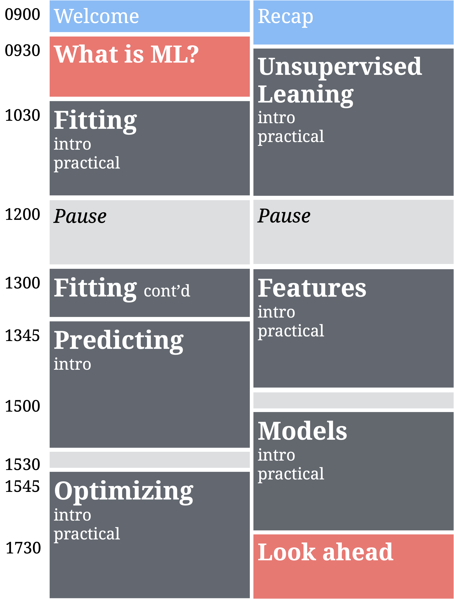
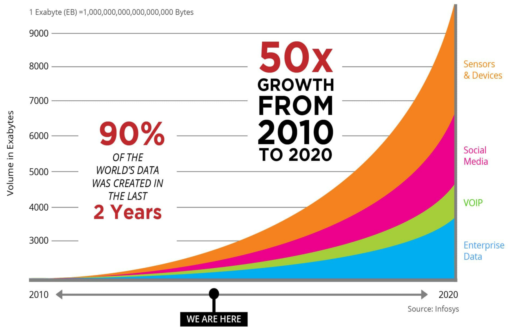
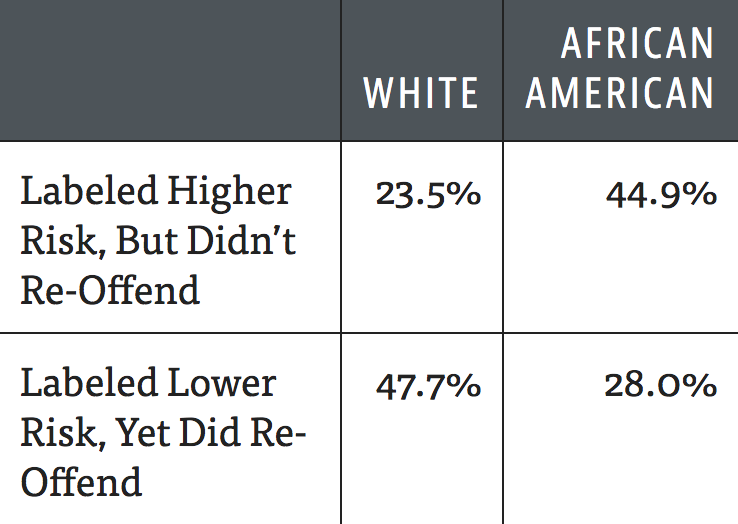
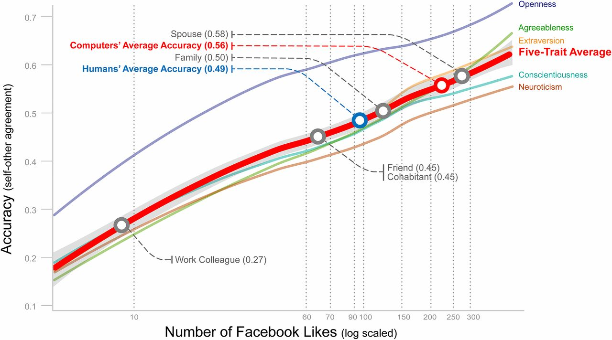
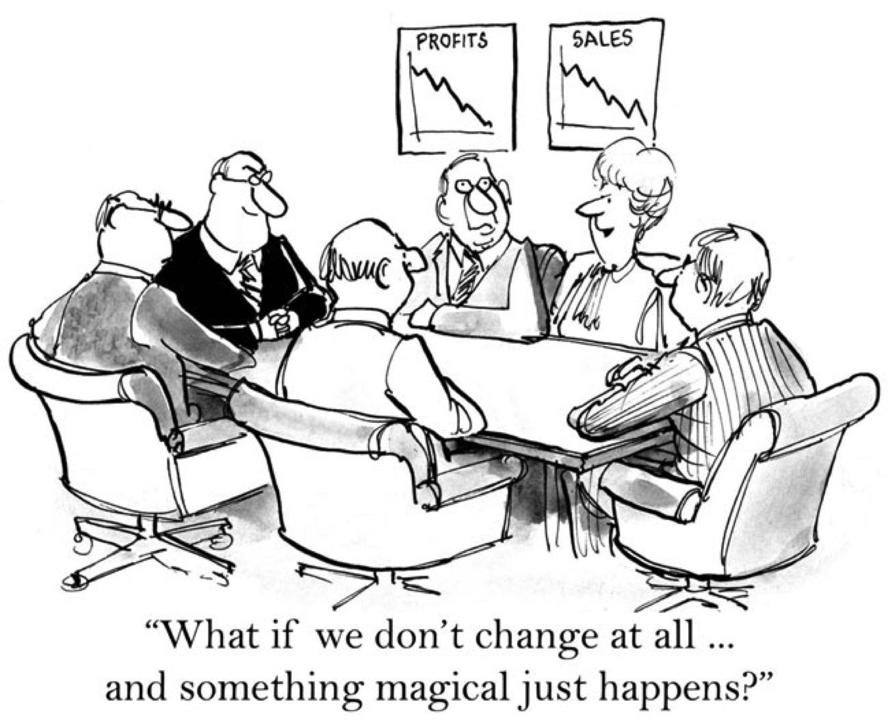

layout: true

<div class="my-footer">
  <span style="text-align:center">
    <span> 
      
    </span>
    <a href="https://therbootcamp.github.io/">
      <span style="padding-left:82px"> 
        <font color="#7E7E7E">
          www.therbootcamp.com
        </font>
      </span>
    </a>
    <a href="https://therbootcamp.github.io/">
      <font color="#7E7E7E">
       Machine Learning with R | November 2020
      </font>
    </a>
    </span>
  </div> 

---

```{r setup, include=FALSE}
options(htmltools.dir.version = FALSE)
# see: https://github.com/yihui/xaringan
# install.packages("xaringan")
# see: 
# https://github.com/yihui/xaringan/wiki
# https://github.com/gnab/remark/wiki/Markdown
options(width=110)
options(digits = 4)
```


.pull-left45[
<br><br><br><br><br>
#  Hello Machine Learning Experts!

In 2 days, you have learned about the fundamentals of machine learning!

]

.pull-right4[


]

---

#  Welcome to the Data Revolution

.pull-left4[

<i>"Machine learning will be the <high>engine of global growth</high>."</i><br>

[Financial times, July 2018]()

<i>"<high>Fuel of the future</high> - Data is giving rise to a new economy."</i><br>

[The Economist, May 2017]()

<i>"Wie Big Data die <high>Finanzmärkte verändern</high> könnte"</i><br>

[NZZ, August 2018]()

]

.pull-right55[
<p align="center">

</p>
]


---

#  Repeating the past

.pull-left45[
### Recidivity risk scores
<p align="center">
  <br>
  <font style="font-size:10px">from <a href="https://www.propublica.org/article/machine-bias-risk-assessments-in-criminal-sentencing">propublica.org</a></font>
</p>
</p>

]

.pull-right45[
### Empirical evaluation
<a href="https://www.propublica.org/article/machine-bias-risk-assessments-in-criminal-sentencing">Pro Publica I</a>, 
<a href="https://www.propublica.org/article/how-we-analyzed-the-compas-recidivism-algorithm">Pro Publica II</a>

<p align = "center">
  <br>
  <font style="font-size:10px">from <a href="https://www.propublica.org/article/machine-bias-risk-assessments-in-criminal-sentencing">propublica.org</a></font>
</p>

]

---

# The end of privacy

.pull-left3[

<i>"Most technologies have their bright and dark side [...] My personal opinion is that a machine's ability to better understand us would lead to improved consumer experience, products, etc… But imagine that we published a clone of youarewhatyoulike.com that simply predicted which of your friends was gay (or Christian or liberal or HIV-positive, etc); lynches are not unlikely to follow…"</i>

Michal Kosinski, Stanford University <a href="https://www.theguardian.com/world/2014/aug/03/internet-death-privacy-google-facebook-alex-preston" style="font-size:8px">[Full text]</a>

]

.pull-right65[

<p align = "center">
  <br>
  <font style="font-size:10px">from <a href="https://www.pnas.org/content/112/4/1036">pnas.org</a></font>
</p>

]


---

# Next steps

.pull-left5[
<font size = 4><i>
<font size = 6>
1. Practice<br>
2. Read books<br>
3. Consult websites<br>
4. Support & consulting<br>
5. Upcoming courses<br>
]

</font>
<br>

.pull-right5[
<p align="center"></p>
]

---

# Books

An incomplete list of good books sorted losely by topic.


<table width="80%" style="cellspacing:0; cellpadding:0; border:none;">

  <tr>    

  <td> 
  <a href="http://r4ds.had.co.nz/"></a>
  </td>

  <td>
  <a href="https://covers.oreillystatic.com/images/0636920028574/cat.gif"></a>
  </td>

  <td> 
  <a href="https://ggplot2-book.org/"></a>
  </td>

  <td>
  <a href="https://www.springer.com/de/book/9783540799979"></a>
  </td>
  
  <td>
  <a href="https://bookdown.org/ndphillips/YaRrr/"></a>
  </td>
  
  <td>
  <a href="https://www.orellfuessli.ch/shop/home/artikeldetails/ID35367941.html?ProvID=10917736&gclid=Cj0KCQiAg_HhBRDNARIsAGHLV5238Q26gQmFttHRnYGjcAhz4CslStb-3qBegvuZS5gnCpWSLNlQvF0aAgfOEALw_wcB"></a>
  </td>
  
  </tr>
  

  <tr style="background-color:#ffffff">

  <td>
  <a href="http://appliedpredictivemodeling.com/"></a>
  </td>
  
  <td>
  <a href="http://www-bcf.usc.edu/~gareth/ISL/ISLR%20First%20Printing.pdf"></a>
  </td>
  
  <td>
  <a href="https://www.manning.com/books/deep-learning-with-r"></a>
  </td>


  <td>
  <a href="https://csgillespie.github.io/efficientR/"></a>
  </td>

  <td>
  <a href="www.rcpp.org/"></a>
  </td>
  
  
  <td>
  <a href="http://adv-r.had.co.nz/"></a>
  </td>


  </tr>
  
</table>
<br>


---

.pull-left4[

# Websites

The web is a great place to learn about R. 

<font size = 4><i>Best begin your journey with:</i></font>

[Google](www.google.com), just be sure to add *r* to the the search query. 

<font size = 4><i>Then you will be redirected to one of two pages</i></font>

[R-bloggers](www.r-bloggers.com) is a website on which R users inform each other on the newest developments. Sign up for newsletter.

[Stackoverflow](www.r-bloggers.com) is a website on which R users exchange problems and solutions to problems. Try post something yourself. You will be amazed by the turnaround. 


]

.pull-right5[
<p align="left" style="padding: 0 0px"><br><br><br><br><br>
    <a href="https://www.google.com/"></a><br><br><br>
    <a href="https://www.r-bloggers.com/"></a><br>
  <a href="https://stackoverflow.com/"></a>
</p>
]


---


# Upcoming courses


<table class="tg"  style="cellspacing:0; cellpadding:0; border:none;">
<tr valign="top">
  <col width="20%">
  <col width="20%">
  <col width="20%">
  <col width="20%">
  <col width="20%">
  <td>
    <p align="center">
      <a class="project-link" href="https://therbootcamp.github.io/#courses" align="center">
      <font style="font-size:20px;weight:700"><br>Einführung in die moderne Datenanalyse mit R</font><br>
      <br>
      </img><br><br>
      <high>August 28,<br>2020</high><br><br><br><br>
    </p>
  </td>
  <td>
    <p align="center">
      <a class="project-link" href="https://therbootcamp.github.io/#courses" align="center">
      <font style="font-size:20px;weight:700"><br>Explorative Datenanalyse mit R<br></font><br>
      <br>
      </img><br><br>
      <high>September 4/5,<br>2020</high><br><br><br><br>
    </p>
  </td>
  <td>
    <p align="center">
      <a class="project-link" href="https://therbootcamp.github.io/#courses" align="center">
      <font style="font-size:20px;weight:700"><br>Statistik mit R<br><br></font><br>
      <br>
      </img><br><br>
      <high>September 25/26,<br>2020</high><br><br><br><br>
      </a>
    </p>
  </td>
  <td>
    <p align="center">
      <a class="project-link" href="https://therbootcamp.github.io/#courses" align="center">
      <font style="font-size:20px;weight:700"><br>Maschinelles Lernen mit R<br></font><br>
      <br>
      </img><br><br>
      <high>Oktober 23/24,<br>2020</high><br><br><br><br>
      </a>
    </p>
  </td>
  <td>
    <p align="center">
      <a class="project-link" href="https://therbootcamp.github.io/#courses" align="center">
      <font style="font-size:20px;weight:700"><br>Reporting mit R<br><br></font><br>
      <br>
      </img><br><br>
      <high>November 5/6,<br>2020</high><br><br><br><br>
      </a>
    </p>
  </td>
  </tr>
  
---

.pull-left45[
# Please give us feedback
<br><br>

<p align = "center">
  </img><br>
  <font style="font-size:10px">from <a href="https://cdn-images-1.medium.com/max/1600/1*5OZNYAfzDZfM1lwJBZEuHQ.png">medium.com</a></font>
</p>

]

.pull-right45[

<p align="center"><br><br><iframe src="https://docs.google.com/forms/d/e/1FAIpQLSerQc1oHWSq2_gh5r0r9b58IzcVUxsUs6ShEuCquZ042hWkgg/viewform?embedded=true" width="430" height="550">Wird geladen...</iframe></p>

]

---

class: center, middle

# Thank you!
