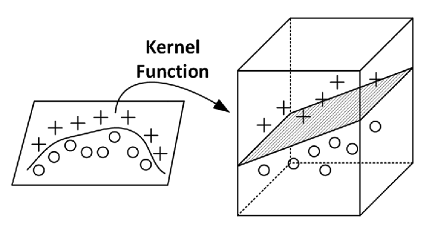
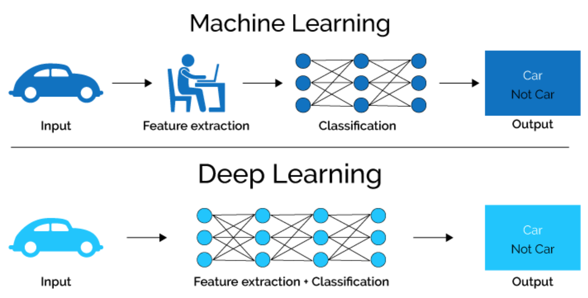
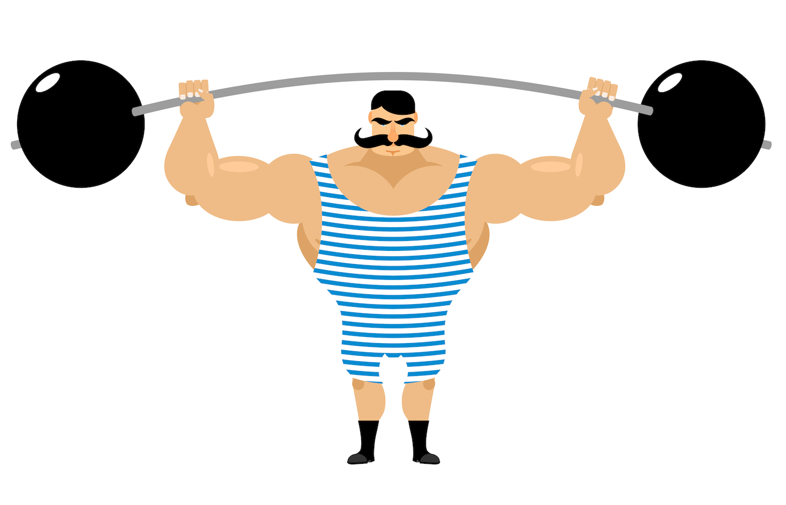

layout: true

<div class="my-footer">
  <span style="text-align:center">
    <span> 
      
    </span>
    <a href="https://therbootcamp.github.io/">
      <span style="padding-left:82px"> 
        <font color="#7E7E7E">
          www.therbootcamp.com
        </font>
      </span>
    </a>
    <a href="https://therbootcamp.github.io/">
      <font color="#7E7E7E">
       Machine Learning with R | November 2020
      </font>
    </a>
    </span>
  </div> 

---

```{r, eval = TRUE, echo = FALSE, warning=F,message=F}
# Code to knit slides
#baselers <- readr::read_csv("../_data/baselers.csv")
```


```{r setup, include=FALSE}
options(htmltools.dir.version = FALSE)
# see: https://github.com/yihui/xaringan
# install.packages("xaringan")
# see: 
# https://github.com/yihui/xaringan/wiki
# https://github.com/gnab/remark/wiki/Markdown
options(width=110)
options(digits = 4)
```

```{r, echo = FALSE ,message = FALSE, warning = FALSE}
knitr::opts_chunk$set(comment=NA, fig.width=6, fig.height=6, echo = TRUE, eval = TRUE, 
                      message = FALSE, warning = FALSE, fig.align = 'center', dpi = 200)
library(tidyverse)
#library(baselers)
library(ggthemes)

source("https://raw.githubusercontent.com/therbootcamp/ML_2019Oct/master/_materials/code/baselrbootcamp_palettes.R")
```


# There is no free lunch

.pull-left35[

<i>"The no-free-lunch theorem of optimization is an impossibility theorem telling us that a general-purpose, universal optimization strategy is impossible. The only way one strategy can outperform another is if it is specialized to the structure of the specific problem
under consideration."</i>

<a href="https://link.springer.com/article/10.1023/A:1021251113462">Ho & Pepyne, 1997</a>
<a href="https://ti.arc.nasa.gov/m/profile/dhw/papers/78.pdf">Wolpert & Macready, 1997</a>

]

.pull-right55[

<p align = "center">
  <br>
  <font style="font-size:10px">from <a href="http://christianfunnypictures.com/2016/02/theres-no-such-thing-as-a-free-lunch-or-is-there.html">christianfunnypictures.com</a></font>
</p>


]

---

.pull-left4[

# Bias-Variance Dilemma

<br>

$$\large Error = Bias + Variance\;(+Noise)$$
<ul style="margin-top:40px">
  <li class="m1"><span><b>Bias</b></span></li>
  <ul class="level">
    <li><span>Arises from strong <high>model assumptions</high> not being met by the environment.</span></li>
  </ul><br>
  <li class="m2"><span><b>Variance</b></span></li>
  <ul class="level">
    <li><span>arises from high <high>model flexibility</high> fitting the noise in the data (i.e., overfitting).</span></li>
  </ul><br>
  <li class="m3"><span><b>Noise</b></span></li>
  <ul class="level">
    <li><span>Fully random noise.</span></li>
  </ul>
</ul>

]

.pull-right45[

<p align="left">
  <br>
  
</p>

]

---

class: center, middle

<h1><a>Know your Problem</a></h1>


---

.pull-left4[
# Linear or non-linear

<ul>
  <li class="m1"><span><b>Linear models</b></span></li>
  <ul class="level">
    <li><span>Linear models make strong model assumptions. They are more often wrong, but also <high>less prone to overfitting</high>.</span></li>
  </ul><br>
  <li class="m2"><span><b>Non-linear models</b></span></li>
  <ul class="level">
    <li><span>Non-linear models make weaker model assumptions, leaving the exact relationship (more) open. They are are closer to the truth, but also <high>more prone to overfitting</high>.</span></li>
  </ul>
</ul>

]

.pull-right5[
  <br><br><br>
  
<p align = "center">
  <br>
  <font style="font-size:10px">from <a href="https://scikit-learn.org/stable/auto_examples/classification/plot_classifier_comparison.html">scikit-learn.org</a></font>
</p>

]


---

.pull-left45[

# Kernel trick

<ul>
  <li class="m1"><span><high>Transforms "input space"</high> into new "feature space" to allows for object separation..</span></li><br>
  <li class="m2"><span>Used in <high>Support Vector Machines</high> (e.g., <mono>method = "svmRadial"</mono>) often using a <high>radial basis function</high> (rbf).</span></li>
</ul>


<p align="center">
  
</p>

]


.pull-right5[

  <br><br><br>
<p align = "center">
  <br>
  <font style="font-size:10px">from <a href="https://scikit-learn.org/stable/auto_examples/classification/plot_classifier_comparison.html">scikit-learn.org</a></font>
</p>


]

---

# Automatic feature engineering

.pull-left3[

<br>

<ul>
  <li class="m1"><span><high>Deep learning</high> aka neural networks and, especially, when using convolutional layers, excel because they generate their own features.</span></li><br>
  <li class="m2"><span>Neural networks are not the focus of <mono>caret</mono> and this course. Powerful implementations based on <high>Google's Tensorflow</high> library are provided by <mono>tensorflow</mono>.</span></li><br>
</ul>


]

.pull-right6[

<br>

<p align = "center">
  <br>
  <font style="font-size:10px">from <a href="https://towardsdatascience.com/cnn-application-on-structured-data-automated-feature-extraction-8f2cd28d9a7e">towardsdatascience.com</a></font>
</p>


]

---

class: center, middle

<h1><a>Keep it robust</a></h1>


---

# Robustness

.pull-left4[

<ul>
  <li class="m1"><span>To produce <high>robust predictions</high> that suffer less from variance ML models use a variety of <high>tricks</high>.</span></li><br>
</ul>


<p align = "center">
  <br>
  <font style="font-size:10px">from <a href="https://www.istockphoto.com/ch/grafiken/kraftathlet?sort=mostpopular&mediatype=illustration&assetfiletype=eps&phrase=kraftathlet">istockphoto.com</a></font>
</p>


]


.pull-right55[
<table style="cellspacing:0; cellpadding:0; border:none;">
  <col width="210">
  <col width="210">
  <col width="210">
<tr>
  <th>Approach</th>
  <th>Implementation</th>
  <th>Examples</th>
</tr>
<tr style="background-color:#ffffff">
  <td align="center"><i>Tolerance</i></td>
  <td align="center">Decrease error tolerance</td>
  <td align="center"><mono>svmRadial</mono></td>
</tr>
<tr style="background-color:#ffffff">
  <td align="center"><i>Regularization</i></td>
  <td align="center">Penalize for complexity</td>
  <td align="center"><mono>lasso</mono>, <mono>ridge</mono>, <mono>elasticnet</mono></td>
</tr>
<tr style="background-color:#ffffff">
  <td align="center"><i>Ensemble</i></td>
  <td align="center">Bagging</td>
  <td align="center"><mono>treebag</mono>, <mono>randomGLM</mono>, <mono>randomForest</mono></td>
</tr>
<tr style="background-color:#ffffff">
  <td align="center"><i>Ensemble</i></td>
  <td align="center">Boosting</td>
  <td align="center"><mono>adaboost</mono>, <mono>xgbTree</mono></td>
</tr>
<tr style="background-color:#ffffff">
  <td align="center"><i>Feature selection</i></td>
  <td align="center">Regularization</td>
  <td align="center"><mono>lasso</mono></td>
</tr>
<tr style="background-color:#ffffff">
  <td align="center"><i>Feature selection</i></td>
  <td align="center">Importance</td>
  <td align="center"><mono>random forest</mono></td>
</tr>
</table>

]


---

# Regularization

.pull-left45[


<ul>
  <li class="m1"><span>Regularization adds <high>penalties for complexity</high> to prevent overfitting.</span></li><br>
</ul>

<br2>
<p align = 'center'><font size=5><high>Loss</high> = <high>Misfit</high> + <high>Penalty</high></font></p>
<br>

<table style="cellspacing:0; cellpadding:0; border:none;">
  <col width="160">
  <col width="160">
  <col width="160">
<tr>
  <th>Name</th>
  <th>Penalty</th>
  <th>`caret`</th>
</tr>
<tr style="background-color:#ffffff">
  <td align="center"><high>AIC/BIC</high></td>
  <td align="center"></td>
  <td align="center">-</td>
</tr>
<tr style="background-color:#ffffff">
  <td align="center"><high>Lasso</high></td>
  <td align="center"></td>
  <td align="center">`method = "glmnet"`</td>
</tr>
<tr style="background-color:#ffffff">
  <td align="center"><high>Ridge</high></td>
  <td align="center"></td>
  <td align="center">`method = "glmnet"`</td>
</tr>
<tr style="background-color:#ffffff">
  <td align="center"><high>Elastic Net</high></td>
  <td align="center"></td>
  <td align="center">`method = "glmnet"`</td>
</tr>
</table>

]


.pull-right5[

```{r, fig.width = 6, fig.height = 5, echo = FALSE, eval = TRUE, warning = FALSE}
set.seed(5)

N <- 40

iv <- rnorm(N, mean = 10, sd = 2)
truth <- iv 
noise <- rnorm(N, mean = 0, sd = 2)
obs <- truth + noise

data <- data.frame(iv, obs)


poly_pred <- map_dfc(.x = c(1, 19), .f = function(degree) {
  
  output <- data.frame(lm(obs ~ poly(iv, degree), data = data)$fitted.values)
  
  names(output) <- paste0("d", degree)
  
  return(output)

}) %>% mutate(id = 1:N,
              x = iv,
              obs = obs) %>%
  gather(Degree, pred, -id, -x, -obs) %>%
  mutate(`Fitting` = abs(pred - obs))


poly_pred <- poly_pred %>%
  mutate(Degree = case_when(Degree == "d1" ~ "Simple",
                            TRUE ~ "Complex"))


overfit_gg <- ggplot(poly_pred, aes(x = x, y = pred, col = Degree)) + 
  geom_line(size = 1.5) +
  geom_point(aes(x = x, y = obs), col = "black", pch = 21) +
  annotate("segment", x = 5, y = 5, xend = 15, yend = 15, col = "black", linetype = 4, size = 1) +
  xlim(5, 15) +
  ylim(5, 15) +
  labs(title = "Model overfitting",
       subtitle = "Dashed line is TRUE model") +
  theme_bw() +
    theme(legend.position="bottom") +
    scale_color_baselrbootcamp()
 
overfit_gg

```

]

---

.pull-left45[

# Bagging

<ul>
  <li class="m1"><span><high>Aggregate</high> predictions from multiple fits to <high>resampled</high> data..</span></li><br>
  <li class="m2"><span>Especially beneficial for models that produce relatively<high>unrobust fits</high>.</span></li><br>
  <li class="m3"><span><b>Algorithm</b>:</span></li>
  <ol>
      <li><span><high>Resample</high> data (with replacement).</span></li>
      <li><span><high>Fit</high> model to resampled data.</span></li>
      <li><span><high>Average</high> predictions.</span></li>
  </ol>
</ul>

]

.pull-right45[
<br><br><br>
<p align = "center">
  <br>
  <font style="font-size:10px">from <a href="https://en.wikipedia.org/wiki/M%C3%BCnchhausen_trilemma">wikipedia.org</a></font>
</p>


]

---

# Boosting

.pull-left4[

<ul>
  <li class="m1"><span>Boosting <high>adaptively re-weights</high> samples based on performance.</span></li><br>
  <li class="m2"><span><mono>adaboost</mono> and <mono>xgbTree</mono> are some of the <high>best ML models out there</high>. </span></li><br>
  <li class="m3"><span><b>Algorithm</b>:</span></li>
  <ol>
      <li><span> Assign <high>equal weight</high> to all cases..</span></li>
      <li><span><high>Fit</high> simple model.</span></li>
      <li><span><high>Increase weight of misfit cases</high> by model misfit for next iteration.</span></li>
      <li><span><high>Repeat</high>.</span></li>
      <li><span><high>Average</high> predictions weighted by model misfit.</span></li>
  </ol>
</ul>


]


.pull-right5[

<p align = "center">
  <br>
  <font style="font-size:10px">from <a href="https://scikit-learn.org/stable/auto_examples/classification/plot_classifier_comparison.html">scikit-learn.org</a></font>
</p>

]

---

# Automatic feature selection

.pull-left45[

<ul>
  <li class="m1"><span><b>LASSO</b></span></li><br>
  <ul>
    <li><span>Regularization can <high>estimate <mono>beta = 0</mono></high> and, thus, essentially deselects that feature.</span></li>
  </ul><br><br>
  <li class="m2"><span><b>Decision Tree / Random forests</b></span></li><br>
  <ul>
    <li><span>Trees reuse features so that <high>unpredictive features may never come to action</high>.</span></li>
  <ul>
</ul>

]


.pull-right45[

<p align="center">
  
  <br>
<font style="font-size:10px">from <a href="https://medium.com/@dkwok94/machine-learning-for-my-grandma-ca242e97ef62">medium.com</a></font>
  
</p>

]

---

<p align = "center">
<br>
</p>


---

# Remember

.pull-left45[

<br>

<i>"…some machine learning projects succeed and some fail. What makes the difference? <high>Easily the most important factor is the features used</high>."</i>

[Pedro Domingos](https://en.wikipedia.org/wiki/Pedro_Domingos)

<br>

<i>"The algorithms we used are very standard for Kagglers. […] <high>We spent most of our efforts in feature engineering.</high> [...] We were also very careful to discard features likely to expose us to the risk of over-fitting our model."</i>

[Xavier Conort]()

]

.pull-right45[

<p align="center">
  <br>
<font style="font-size:10px">from <a href="http://www.open.edu/openlearncreate/mod/oucontent/view.php?id=80245&section=1">open.edu</a></font>
</p>

]


---

class: middle, center

<!---<h1><a href="">Practical<br>(not yet)</a></h1>--->

<h1><a href="https://therbootcamp.github.io/ML-DHLab/_sessions/Models/Models_practical.html">Practical</a></h1>


