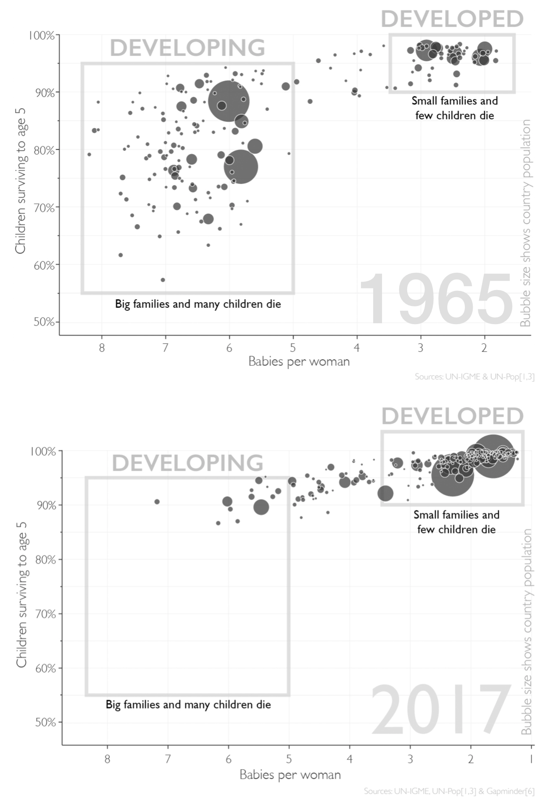
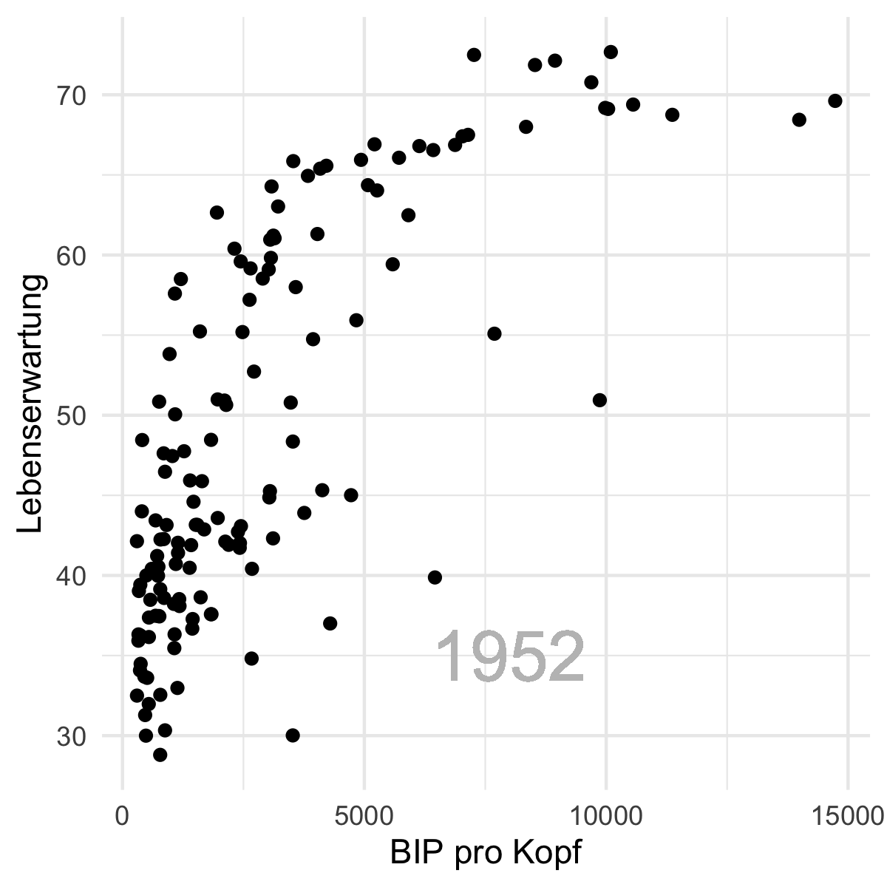
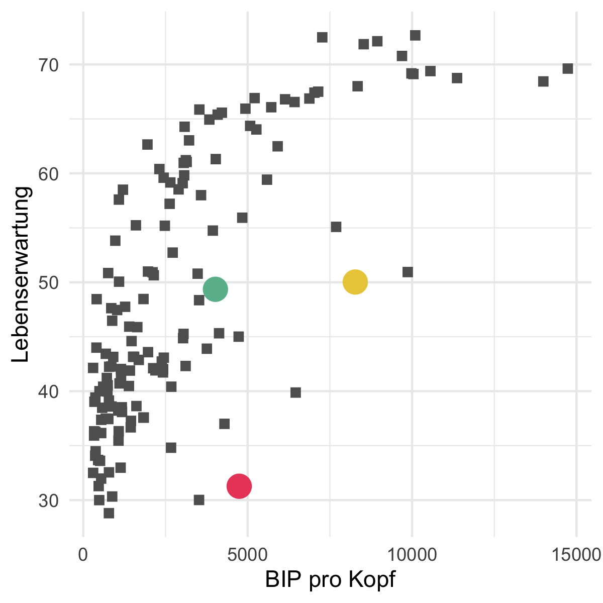
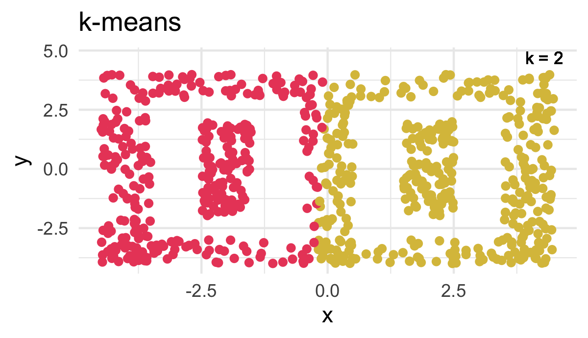
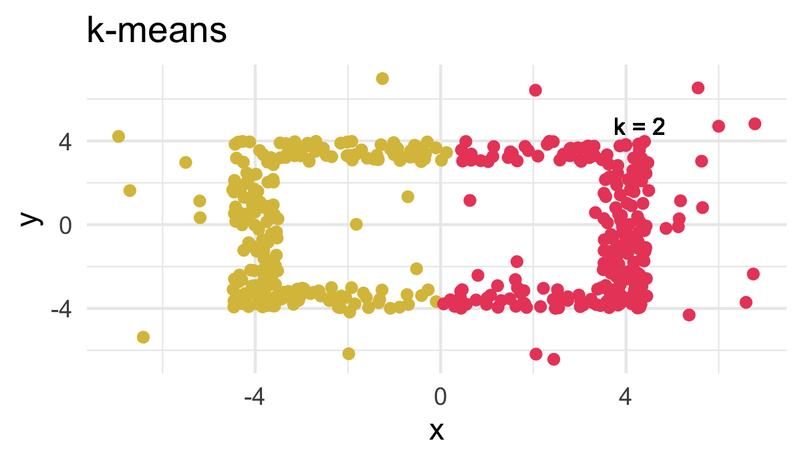
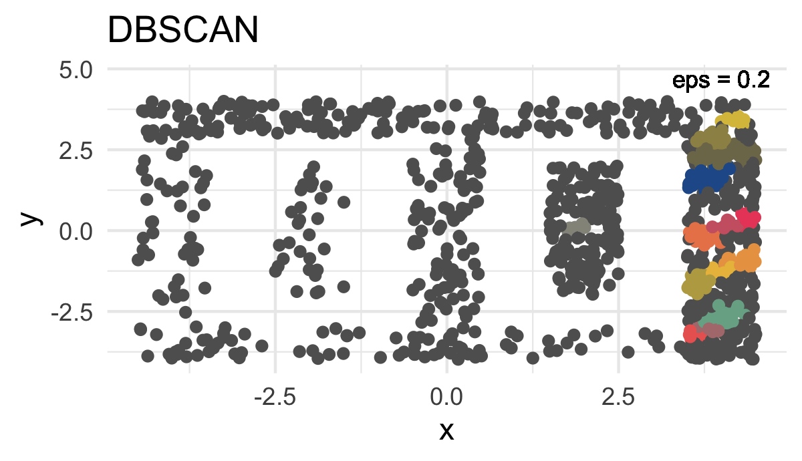
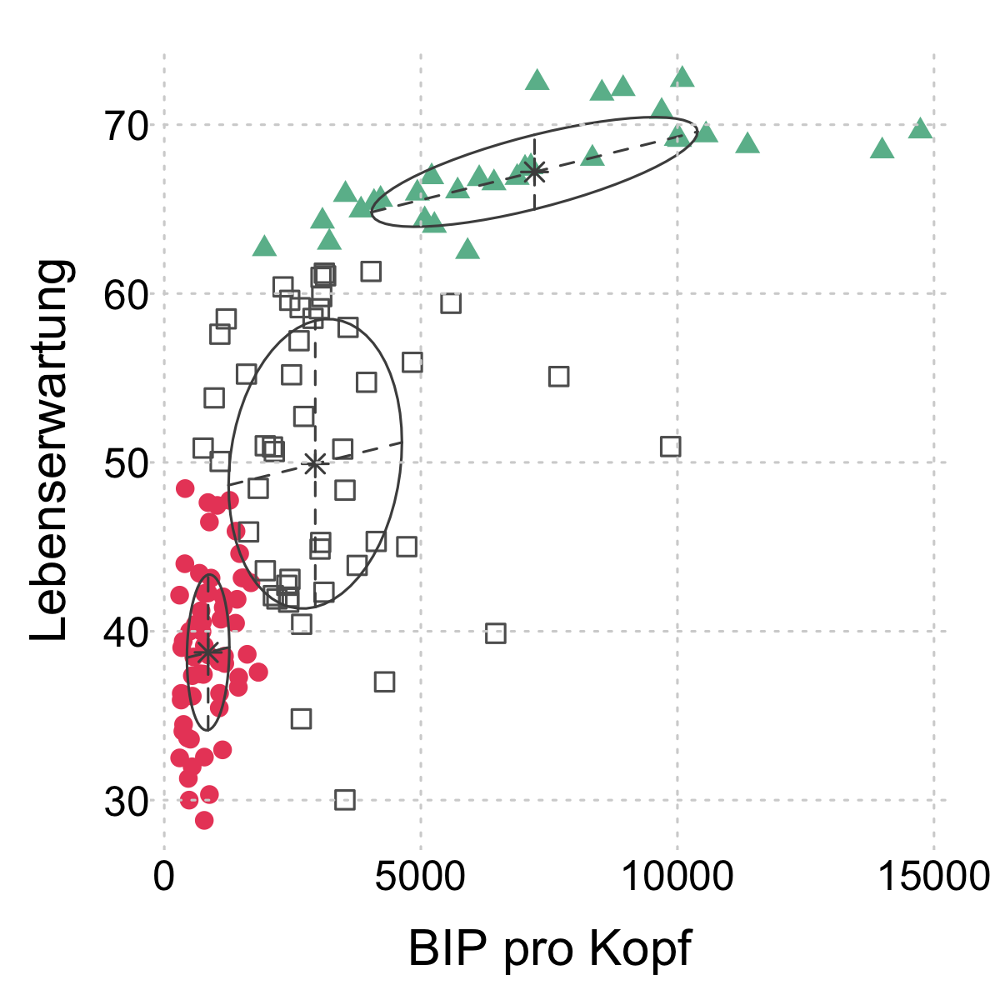

layout: true

<div class="my-footer">
  <span style="text-align:center">
    <span> 
      
    </span>
    <a href="https://therbootcamp.github.io/">
      <span style="padding-left:82px"> 
        <font color="#7E7E7E">
          www.therbootcamp.com
        </font>
      </span>
    </a>
    <a href="https://therbootcamp.github.io/">
      <font color="#7E7E7E">
      Machine Learning with R | November 2020
      </font>
    </a>
    </span>
  </div> 

---

```{r, eval = TRUE, echo = FALSE, warning=F,message=F}
library(tidyverse)
# Code to knit slides
#baselers <- readr::read_csv("/1_Data/basel.csv")


source("https://raw.githubusercontent.com/therbootcamp/ML_2019Oct/master/_materials/code/baselrbootcamp_palettes.R")
```


```{r setup, include=FALSE}
options(htmltools.dir.version = FALSE)
# see: https://github.com/yihui/xaringan
# install.packages("xaringan")
# see:
# https://github.com/yihui/xaringan/wiki
# https://github.com/gnab/remark/wiki/Markdown
options(width=110)
options(digits = 4)

require(tidyverse)
gap1952 = gapminder::gapminder %>% filter(country != 'Kuwait') %>%
  rename('BIP pro Kopf' = gdpPercap, Lebenserwartung = lifeExp) %>% 
  filter(year == 1952) %>% select('BIP pro Kopf', Lebenserwartung)

```


# Unsupervised learning

.pull-left45[

<ul>
  <li class="m1"><span>The gaol of Unsupervised learning is the identifikation of <high>hidden structure</high> in the <high>similarities</high> of cases or features.</span></li><br>
  <li class="m2"><span>There are two domains: <high>cluster analysis</high> and <high>dimensionality reduction</high>.</span></li><br>
</ul>

]


.pull-right45[

<p align = "center">
<br>
<font style="font-size:10px">from <a href="https://www.c-span.org/organization/?9764/Copley-News-Service">c-span.org</a></font>
</p>

]

---

.pull-left35[

# Two domains of UL

<ul>
  <li class="m1"><span><b>Dimensionality reduction</b></span></li>
  <ul>
    <li><span>Focuses on the similarities of <high>features</high>.</span></li>
    <li><span>Aims to <high>identify relevant dimensions</high> in the data and is the basis of deep learning.</span></li>
  </ul><br>
  <li class="m2"><span><b>Cluster analysis</b></span></li>
  <ul>
    <li><span>Focuses on the similarities of <high>cases</high>.</span></li>
    <li><span>ims to <high>identify groups and outliers</high> in the data.</span></li>
  </ul>  
</ul>

]


.pull-right55[

<br>

<p align = "center">
<br>
</p>

]


---

.pull-left4[

# Gapminder

<ul>
  <li class="m1"><span>Hans Rosling's Gapminder project maps the <high>health and economic development of countries</high> in the world.</span></li>
  <li class="m2"><span>Are there clearly separable classes of countries</high>: e.g. <high>Developed versus Devloping</high> countries.</span></li>
</ul>

<p align = "center" style="margin-top:55px">
<br>
<font style="font-size:10px">Hans Rosling, 1948-2017, adapted from <a href="https://www.volkskrant.nl/cultuur-media/hans-rosling-68-volksverheffer-met-rocksterstatus~b3746a58/?referer=https%3A%2F%2Fwww.google.com%2F">volkskrant.nl</a></font>
</p>

]


.pull-right5[
<br>
<p align = "center">
<br>
<font style="font-size:10px">adapted from <a href="https://www.ullstein-buchverlage.de/nc/buch/details/factfulness-9783548060415.html">Factfulness, Hans Rosling, Ullstein</a></font>
</p>

]

---

.pull-left4[

# Gapminder

<ul>
  <li class="m1"><span>Hans Rosling's Gapminder project maps the <high>health and economic development of countries</high> in the world.</span></li>
  <li class="m2"><span>Are there clearly separable classes of countries</high>: e.g. <high>Developed versus Devloping</high> countries.</span></li>
</ul>

<p align = "center" style="margin-top:55px">
<br>
<font style="font-size:10px">Hans Rosling, 1948-2017, adapted from <a href="https://www.volkskrant.nl/cultuur-media/hans-rosling-68-volksverheffer-met-rocksterstatus~b3746a58/?referer=https%3A%2F%2Fwww.google.com%2F">volkskrant.nl</a></font>
</p>

]


.pull-right5[
<br>
<p align = "center">
<br>
<font style="font-size:10px">data from <a href="https://cran.r-project.org/web/packages/gapminder/README.html">gapminder</a></font>
</p>

]

---

.pull-left4[

# Gap in 1952

<ul>
  <li class="m1"><span>In 1952, are there <high>classes of countries</high> concerning life expectancy and GDP per capita?</span></li><br>
  <li class="m2"><span>Algorithms:</span></li><br>
  <ul>
    <li><span><high><i>k</i>-means</high></span></li><br>
    <li><span><high>DBSCAN</high></span></li><br>
    <li><span><high>Gaussian mixtures</high></span></li>
  </ul>
</ul>

]


.pull-right5[
<br>
<p align = "center">
<br>
</p>

]


---

.pull-left4[

# <i>k</i>-means

<ul>
  <li class="m1"><span>Maybe the most frequently employed algorithms for cluster analysis.</span></li><br>
  <li class="m2"><span><b>Algorithm</b></span></li><br>
  <ol class="">
    <li><span>Random <high>start points</high> for cluster centroids.</span></li><br>
    <li><span>Assign cases to <high>closest centroids</high>.</span></li><br>
    <li><span>Calculate <high>new cluster centroids</high> as average of all points.</span></li>
  </ol>
</ul>

]

.pull-right5[

<br>
<p align = "center">
<br>
</p>

]

---

.pull-left4[

# <i>k</i>-means

<ul>
  <li class="m1"><span>Maybe the most <high>frequently employed</high> algorithms for cluster analysis.</span></li><br>
  <li class="m2"><span><b>Algorithm</b></span></li><br>
  <ol class="">
    <li><span>Random <high>start points</high> for cluster centroids.</span></li><br>
    <li><span>Assign cases to <high>closest centroids</high>.</span></li><br>
    <li><span>Calculate <high>new cluster centroids</high> as average of all points.</span></li>
  </ol>
</ul>

]

.pull-right5[

<br>

```{r, echo = F}
options(width=50)
```

```{r}

# calculate k-means
gap_kmeans <- kmeans(gap1952, 
                     centers = 3)

# show content
names(gap_kmeans)

# show clusters
gap_kmeans$cluster

```


]


---

.pull-left4[

# <i>k</i>-selection

<ul>
  <li class="m1"><span>There is <high>no correct <i>k</i></high>!</span></li><br>
  <li class="m2"><span>Comparing two aspects a <high>reasonable <i>k</i></high> might be found:</span></li>
  <ul>
    <li><span><i>k</i> should be <high>as small as possible</high>.</span></li>
    <li><span>The <i>k</i> clusters should describe the data <high>as accurately as possible</high>.</span></li>
  </ul><br>
  <li class="m3"><span><b>Approaches</b></span></li>
  <ul>
    <li><span>Elbow of the <high>within variance</high>.</span></li>
    <li><span>Gap-statistic.</span></li>
    <li><span>Slope-statistic.</span></li>
    <li><span>Cluster-instability.</span></li>
    <li><span>etc.</span></li>
  </ul>
  </ul>
</ul>

]

.pull-right5[

<br>

<p align = "center">
<br>
<br>
</p>

]

---

.pull-left4[

# <i>k</i>-selection

<ul>
  <li class="m1"><span>There is <high>no correct <i>k</i></high>!.</span></li><br>
  <li class="m2"><span>Comparing two aspects <high>reasonable <i>k</i></high> can be identified:</span></li>
  <ul>
    <li><span><i>k</i> should be <high>as small as possible</high>.</span></li>
    <li><span>The <i>k</i> clusters should describe the data <high>as accurately as possible</high>.</span></li>
  </ul><br>
  <li class="m3"><span><b>Approaches</b></span></li>
  <ul>
    <li><span>Elbow of the <high>within variance</high>.</span></li>
    <li><span>Gap-statistic.</span></li>
    <li><span>Slope-statistic.</span></li>
    <li><span>Cluster-instability.</span></li>
    <li><span>etc.</span></li>
  </ul>
  </ul>
</ul>

]

.pull-right5[

<br><br><br><br>

```{r, echo = F}
options(width=50)
```

```{r, message = F}

# load cstab
library(cstab)

# calculate k-sel
gap_ksel <- cDistance(as.matrix(gap1952), 
                      kseq = 2:10,
                      method = "kmeans")

# show estimated cluster number
gap_ksel$k_Gap
gap_ksel$k_Slope

```
]

---

.pull-left4[

# <i>k</i>-selection

<ul>
  <li class="m1"><span>There is <high>no correct <i>k</i></high>!.</span></li><br>
  <li class="m2"><span>Comparing two aspects <high>reasonable <i>k</i></high> can be identified:</span></li>
  <ul>
    <li><span><i>k</i> should be <high>as small as possible</high>.</span></li>
    <li><span>The <i>k</i> clusters should describe the data <high>as accurately as possible</high>.</span></li>
  </ul><br>
  <li class="m3"><span><b>Approaches</b></span></li>
  <ul>
    <li><span>Elbow of the <high>within variance</high>.</span></li>
    <li><span>Gap-statistic.</span></li>
    <li><span>Slope-statistic.</span></li>
    <li><span>Cluster-instability.</span></li>
    <li><span>etc.</span></li>
  </ul>
  </ul>
</ul>

]

.pull-right5[

<br><br><br><br>

```{r, echo = F, message=F}
options(width=50)
library(cstab)
gap_ksel <- cStability(as.matrix(gap1952), 
                      kseq = 2:10, nB=20,
                      method = "kmeans",
                      pbar = F)
```

```{r, eval = F, message = F}

# load cstab
library(cstab)

# calculate k-sel
gap_ksel <- cStability(as.matrix(gap1952), 
                      kseq = 2:10,
                      method = "kmeans")
```

```{r, message = F}
# show estimated cluster number
gap_ksel$k_instab

```


]


---

.pull-left4[

# DBSCAN

<ul>
  <li class="m1"><span>DBSCAN = Density-Based Spatial Clustering of Applications with Noise.</span></li><br>
  <li class="m2"><span><b>Algorithm</b></span></li><br>
  <ol>
    <li><span>For every point, check other <high>points with distance <b>&epsilon;</b></high>:<br>a. N = 0 <b>&rarr;</b> <high>outlier</high><br>b. N &ge; <i>minPts</i> <b>&rarr;</b> <high>core point</high><br>c. <i>minPts</i> &gt; N &gt; 0 <b>&rarr;</b> <high>undetermined</high></span></li><br>
    <li><span>Join <high>core points</high> with distance &lt <b>&epsilon;</b>; to clusters.</span></li><br>
    <li><span>Add <high>Undetermined points</high> with distance &lt <b>&epsilon;</b>; to core points to cluster, otherwise outlier.</span></li>
  </ol>
</ul>

]

.pull-right5[

<br>
<p align = "center">
<font style="font-size:20px;font-weight:900">&epsilon; = .2</font>
<br>
</p>

]

---

.pull-left4[

# DBSCAN

<ul>
  <li class="m1"><span>DBSCAN = Density-Based Spatial Clustering of Applications with Noise.</span></li><br>
  <li class="m2"><span><b>Algorithm</b></span></li><br>
  <ol>
    <li><span>For every point, check other <high>points with distance <b>&epsilon;</b></high>:<br>a. N = 0 <b>&rarr;</b> <high>outlier</high><br>b. N &ge; <i>minPts</i> <b>&rarr;</b> <high>core point</high><br>c. <i>minPts</i> &gt; N &gt; 0 <b>&rarr;</b> <high>undetermined</high></span></li><br>
    <li><span>Join <high>core points</high> with distance &lt <b>&epsilon;</b>; to clusters.</span></li><br>
    <li><span>Add <high>Undetermined points</high> with distance &lt <b>&epsilon;</b>; to core points to cluster, otherwise outlier.</span></li>
  </ol>
</ul>

]

.pull-right5[

<br>
<p align = "center">
<font style="font-size:20px;font-weight:900">&epsilon; = .3</font>
<br>
</p>

]

---

.pull-left4[

# DBSCAN

<ul>
  <li class="m1"><span>DBSCAN = Density-Based Spatial Clustering of Applications with Noise.</span></li><br>
  <li class="m2"><span><b>Algorithm</b></span></li><br>
  <ol>
    <li><span>For every point, check other <high>points with distance <b>&epsilon;</b></high>:<br>a. N = 0 <b>&rarr;</b> <high>outlier</high><br>b. N &ge; <i>minPts</i> <b>&rarr;</b> <high>core point</high><br>c. <i>minPts</i> &gt; N &gt; 0 <b>&rarr;</b> <high>undetermined</high></span></li><br>
    <li><span>Join <high>core points</high> with distance &lt <b>&epsilon;</b>; to clusters.</span></li><br>
    <li><span>Add <high>Undetermined points</high> with distance &lt <b>&epsilon;</b>; to core points to cluster, otherwise outlier.</span></li>
  </ol>
</ul>

]

.pull-right5[

<br><br><br><br>

```{r, echo = F, message=F}
options(width=50)
```

```{r, eval = T, message = F}

# load dbscan
library(dbscan)

# calculate dbscan
gap_dbscan <- dbscan(scale(gap1952), 
                     eps = .2)

# show results
gap_dbscan

```

]

---

.pull-left4[

# Eigenschaften von DBSCAN

<ul>
  <li class="m1"><span><b>Advantages</b></span></li>
  <ul>
    <li><span><high>Identifies <i>k</i></high> automatically.</span></li>
    <li><span>Can identify <high>"complex" clusters</high>.</span></li>
    <li><span>Can identify <high>outliers</high>.</span></li>
  </ul>
<li class="m2"><span><b>Disadvantages</b>.</span></li>
  <ul>
    <li><span><high>Very sensitive</high> to parameter settings.</span></li>
    <li><span>Hard time with <high>clusters of different density</high>.</span></li>
  </ul>
</ul>

]

.pull-right5[

<p align = "center">
<br>
<br>
</p>

]

---

.pull-left4[

# Properties of DBSCAN

<ul>
  <li class="m1"><span><b>Advantages</b></span></li>
  <ul>
    <li><span><high>Identifies <i>k</i></high> automatically.</span></li>
    <li><span>Can identify <high>"complex" clusters</high>.</span></li>
    <li><span>Can identify <high>outliers</high>.</span></li>
  </ul>
<li class="m2"><span><b>Disadvantages</b>.</span></li>
  <ul>
    <li><span><high>Very sensitive</high> to parameter settings.</span></li>
    <li><span>Hard time with <high>clusters of different density</high>.</span></li>
  </ul>
</ul>

]

.pull-right5[

<p align = "center">
<br>
<br>
</p>

]


---

.pull-left4[

# Properties of DBSCAN

<ul>
  <li class="m1"><span><b>Advantages</b></span></li>
  <ul>
    <li><span><high>Identifies <i>k</i></high> automatically.</span></li>
    <li><span>Can identify <high>"complex" clusters</high>.</span></li>
    <li><span>Can identify <high>outliers</high>.</span></li>
  </ul>
<li class="m2"><span><b>Disadvantages</b>.</span></li>
  <ul>
    <li><span><high>Very sensitive</high> to parameter settings.</span></li>
    <li><span>Hard time with <high>clusters of different density</high>.</span></li>
  </ul>
</ul>

]

.pull-right5[

<p align = "center">
<br>
<br>
</p>

]

---

.pull-left4[

# Gaussian mixtures

<ul>
  <li class="m1"><span>A probabilistic <high>extension of <i>k</i>-means algorithm</high> on the basis of multi-variate normal distributions</span></li>
  <li class="m2"><span>Works well with clusters of different <high>orientation and density</high></span></li>
    <li class="m3"><span>Straighforward estimation of <i>k</i> via <high>model comparison</high></span></li>
    <li class="m4"><span>Difficulties with <high>complex topologies</high>.</span></li>
</ul>

]

.pull-right5[

<br>

<p align = "center">
<br>
</p>

]

---

.pull-left4[

# Gaussian mixtures

<ul>
  <li class="m1"><span>A probabilistic <high>extension of <i>k</i>-means algorithm</high> on the basis of multi-variate normal distributions</span></li>
  <li class="m2"><span>Works well with clusters of different <high>orientation and density</high></span></li>
    <li class="m3"><span>Straighforward estimation of <i>k</i> via <high>model comparison</high></span></li>
    <li class="m4"><span>Difficulties with <high>complex topologies</high>.</span></li>
</ul>

]

.pull-right5[

<br>

<p align = "center">
<br>
</p>

]

---

.pull-left4[

# Gaussian mixtures

<ul>
  <li class="m1"><span>A probabilistic <high>extension of <i>k</i>-means algorithm</high> on the basis of multi-variate normal distributions</span></li>
  <li class="m2"><span>Works well with clusters of different <high>orientation and density</high></span></li>
    <li class="m3"><span>Straighforward estimation of <i>k</i> via <high>model comparison</high></span></li>
    <li class="m4"><span>Difficulties with <high>complex topologies</high>.</span></li>
</ul>

]

.pull-right5[

<br><br><br><br>

```{r, echo = F, message=F}
options(width=50)
```

```{r, eval = T, message = F}

# load gaussian mixture package
library(mclust)

# calculate gaussian mixture
gap_mclust <- Mclust(gap1952)

# show results
gap_mclust

```

]

---

.pull-left4[

# Gaussian mixtures

<ul>
  <li class="m1"><span>A probabilistic <high>extension of <i>k</i>-means algorithm</high> on the basis of multi-variate normal distributions</span></li>
  <li class="m2"><span>Works well with clusters of different <high>orientation and density</high></span></li>
    <li class="m3"><span>Straighforward estimation of <i>k</i> via <high>model comparison</high></span></li>
    <li class="m4"><span>Difficulties with <high>complex topologies</high>.</span></li>
</ul>

]

.pull-right5[

<br><br><br><br>

```{r, echo = F, message=F}
options(width=50)
```

```{r, eval = T, message = F}

# lade gaussian mixture
library(mclust)

# berechne gaussian mixture
gap_mclust <- Mclust(gap1952)

# zeige Ergebnis
gap_mclust$classification

```

]


---
class: middle, center

<h1><a href=https://therbootcamp.github.io/ML-DHLab/_sessions/Unsupervised/Unsupervised_practical.html>Practical</a></h1>
