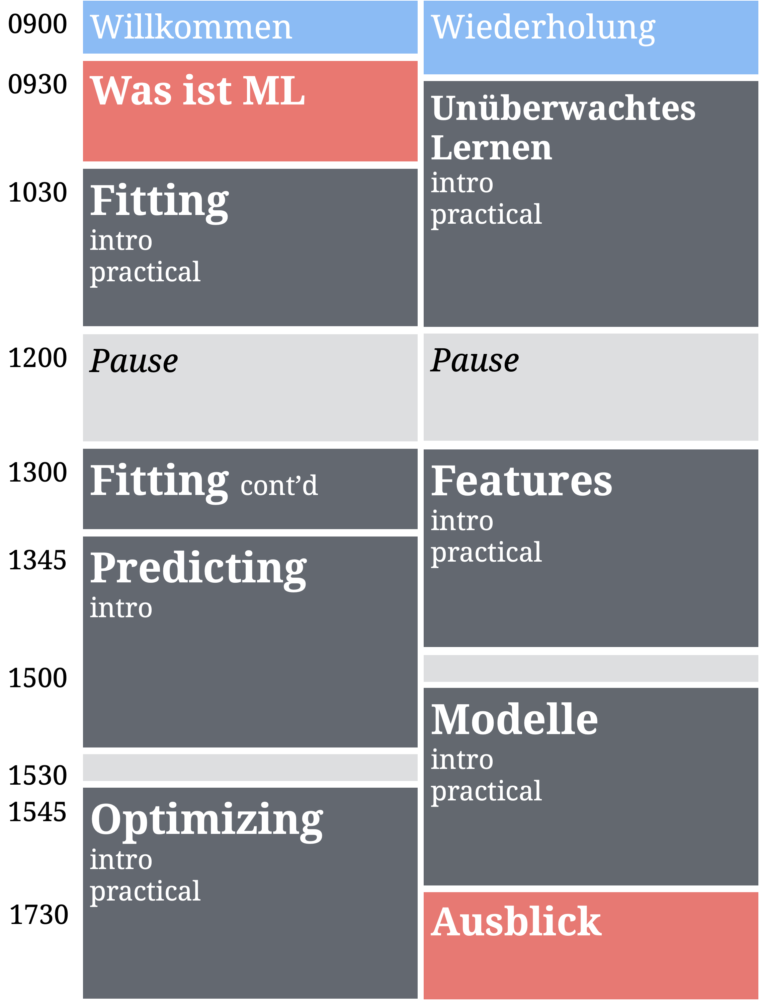
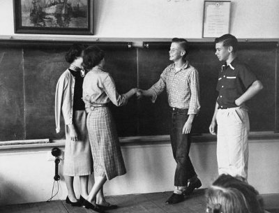

layout: true

<div class="my-footer">
  <span style="text-align:center">
    <span> 
      
    </span>
    <a href="https://therbootcamp.github.io/">
      <span style="padding-left:82px"> 
        <font color="#7E7E7E">
          www.therbootcamp.com
        </font>
      </span>
    </a>
    <a href="https://therbootcamp.github.io/">
      <font color="#7E7E7E">
      Machine Learning with R | November 2020
      </font>
    </a>
    </span>
  </div> 

---


```{r setup, include=FALSE}
options(htmltools.dir.version = FALSE)
options(width=110)
options(digits = 4)

knitr::opts_chunk$set(fig.align = 'center')
```

.pull-left6[

<br><br><br><br><br>


# Aim


>###The aim of this workshop is enable you to thoughtfully implement machine learning methods, using R, to make data-driven decisions.

]

.pull-right4[

<br><br><br><br>
<p align="center"></p>

]


---

.pull-left4[

<br>

# Schedule 

<ul>
  <li class="m1"><span><high>Workshop</high></span></li>
  <ul class="level">
    <li><span>3 sessions on Fundamentals: Fitting, Predicting, Optimizing</span></li>
    <li><span>1 sessions on Unsupervised Learning</span></li>
    <li><span>2 sessions on practial considerations</span></li>
  </ul><br>
  <li class="m2"><span><high>Session</high>
  <ul class="level">
    <li><span>Slide-based Intro</span></li>
    <li><span>Many exercises</span></li>
    <li><span>Interactive summary</span></li>
  </ul>
  </span></li>
</ul>

]

.pull-right45[
<br><br>


]


---

# Introduction


.pull-left45[

<ul>
  <li class="m1"><span><high>Intro</high></span></li><br>
  <ul class="level">
    <li><span>30-45 min</span></li>
    <li><span>Concepts & code examples</span></li>
  </ul><br>
  <li class="m2"><span><high>Materials</high></span></li><br>
  <ul class="level">
    <li><span>Always <a href="https://therbootcamp.github.io/ML-DHLab/">online available</a></span></li>
  </ul>
  </span></li>
</ul>
]

.pull-right55[

<p align="center">

<br>
<font style="font-size:10px">from <a href="www.Freepik.com">Freepik.com</a></font>
</p>

]


---

.pull-left45[

# Practicals

<ul>
  <li class="m1"><span><high>Program yourself</high>
  <br><br>
  <ul class="level">
    <li><span>20 - 50 Tasks</span></li>
    <li><span>Begins easy, increasingly difficult.</span></li>
    <li><span>Follow your own speed.</span></li>
    <li><span>Answers will be provided later.</span></li>
  </ul>
  </span></li>
</ul>

]

.pull-right5[
<br>

  <iframe src="https://therbootcamp.github.io/ML_2019Oct/_sessions/Fitting/Fitting_practical.html" height="480px" width = "500px"></iframe>

  Example: <a href="https://therbootcamp.github.io/dML_2019Oct/_sessions/Fitting/Fitting_practical.html">Fitting Practical </a>

]

---

# Introductions

.pull-left5[

<ul>
  <li class="m1"><span>What is your name?</span></li>
  <li class="m2"><span>What is your field/position?</span></li>
  <li class="m3"><span>How experienced are you with R and other programming languages?</span></li>
  <li class="m4"><span>Do you have experience with ML and what would you like to use it for?</span></li>
  <li class="m5"><span>Coffee or tea?</span></li>
  <li class="m6"><span>Beer or wine?</span></li>
  <li class="m7"><span>Berlin or Paris?</span></li>
</ul>

]

.pull-right45[

<p align="center">

<br>
<font style="font-size:10px">from <a href="www.artofmanliness.com">artofmanliness.com</a></font>
</p>

]


---
class: middle, center

<h1><a href=https://therbootcamp.github.io/ML-DHLab/index.html>Schedule</a></h1>


