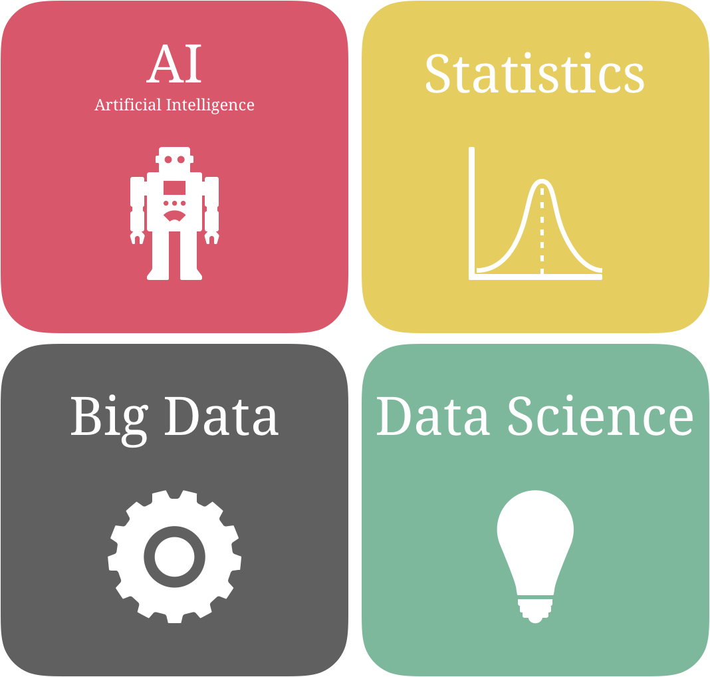
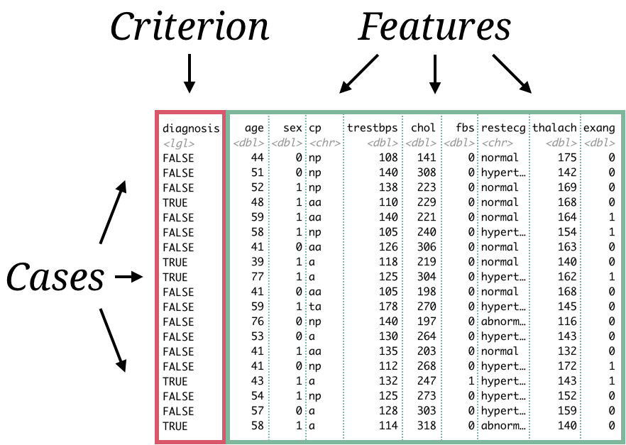
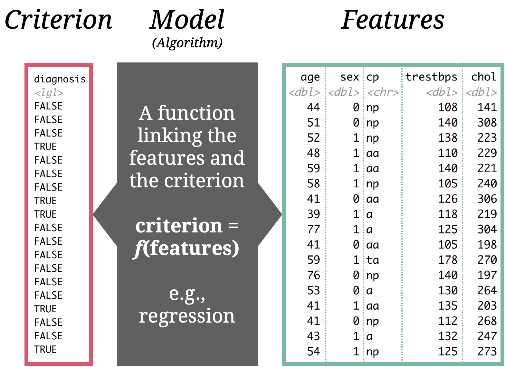
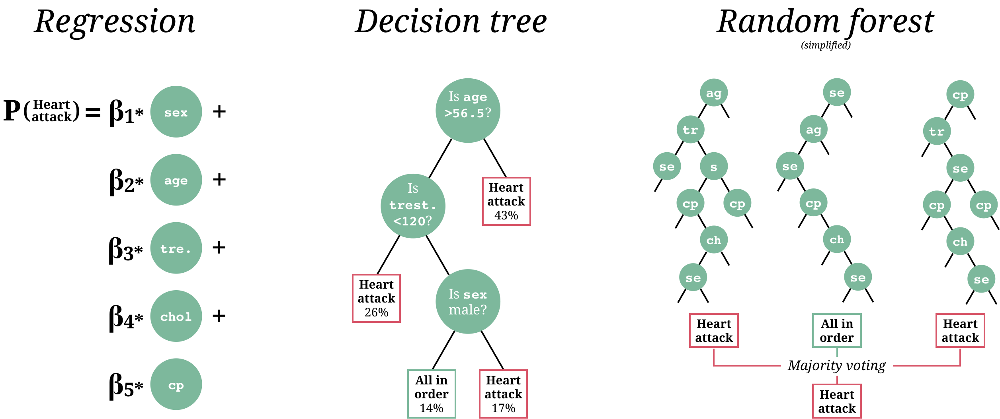
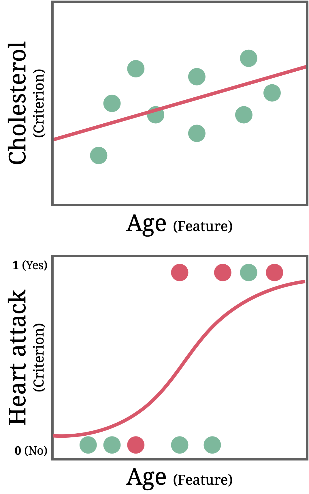
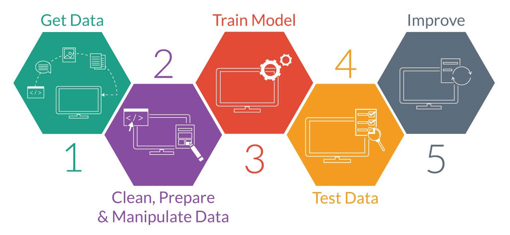

layout: true

<div class="my-footer">
  <span style="text-align:center">
    <span> 
      
    </span>
    <a href="https://therbootcamp.github.io/">
      <span style="padding-left:82px"> 
        <font color="#7E7E7E">
          www.therbootcamp.com
        </font>
      </span>
    </a>
    <a href="https://therbootcamp.github.io/">
      <font color="#7E7E7E">
       Machine Learning with R | November 2020
      </font>
    </a>
    </span>
  </div> 

---

class: middle, center

```{r setup, include=FALSE}
options(htmltools.dir.version = FALSE)
options(width=110)
options(digits = 4)
library(tidyverse)
baselers <- read_csv("https://raw.githubusercontent.com/therbootcamp/baselers/master/inst/extdata/baselers.txt")
```


# What do you think?

No Googling :)

---

# What is machine learning?

.pull-left45[

<ul>
  <li class="m1"><span><b>Machine learning is</b>...</span></li><br>
  <ul class="level">
    <li><span>...an <high>area of artificial intelligence</high>...</span></li><br>
    <li><span>...that uses <high>statistical methods</high>...</span></li><br>
    <li><span>...to computers to <high>learn</high>...</span></li><br>
    <li><span>...i.e., to iteratively <high>improve</high> task performance...</span></li><br>
    <li><span>...on the basis of available <high>data</high>.</span></li>
  </ul>
</ul>

]


.pull-right45[

<p align = "center">
<br>
<font style="font-size:10px">from <a href="https://medium.com/@dkwok94/machine-learning-for-my-grandma-ca242e97ef62">medium.com</a></font>
</p>


]

---

.pull-left5[

# Easy to confuse

<ul>
  <li class="m1"><span><b>AI</b></span></li><br>
  <li class="m2"><span><b>Statistics</b></span></li><br>
  <li class="m3"><span><b>Big Data</b></span></li><br>
  <li class="m4"><span><b>Data Science</b></span></li>
</ul>

]


.pull-right4[

<br><br><br><br><br>

<p align = "center">
<br>
</p>

]


---

.pull-left5[

# Easy to confuse

<ul>
  <li class="m1"><span><b>AI</b></span></li>
  <ul class="level">
    <li><span><high>Intelligence demonstrated by machines</high>, in contrast to the natural intelligence displayed by humans and animals.</span></li>
  </ul>
  <li class="m2"><span><b>Statistics</b></span></li>
  <ul class="level">
    <li><span><high>Branch of mathematics</high> dealing with data collection, organization, analysis, interpretation and presentation.</span></li>
  </ul>
  <li class="m3"><span><b>Big Data</b></span></li>
  <ul class="level">
    <li><span>Deals with data sets that are <high>too large or complex</high> to be dealt with by traditional data-processing application software.</span></li>
  </ul>
  <li class="m4"><span><b>Data Science</b></span></li>
  <ul class="level">
    <li><span>A multi-disciplinary field that uses scientific methods, processes, algorithms and systems to <high>extract knowledge and insights</high> from structured and unstructured data.</span></li>
  </ul>
</ul>

]


.pull-right4[

<br><br><br><br><br>

<p align = "center">
<br>
</p>

]


---

# ML's origin

<div align="center">
<iframe width="800" height="450" src="https://www.youtube.com/embed/cNxadbrN_aI" frameborder="0" allow="accelerometer; autoplay; encrypted-media; gyroscope; picture-in-picture" allowfullscreen></iframe>
</div>


---

.pull-left3[

# Types of machine learning tasks

<ul>
  <li class="m1"><span>There are many types of machine learning tasks, each of which call for different models.</span></li>
  <li class="m2"><span><high>We will focus on supervised machine learning</high>.</span></li>
</ul>

]

.pull-right65[

<br><br>

<p align = "center">
<br>
<font style="font-size:10px">from <a href="image/mltypes.png">amazonaws.com</a></font>
</p>
]


---

# Data terminology


.pull-left5[
<p>
<table style="cellspacing:0; cellpadding:0; border:none; padding-top:10px">

<tr>
  <td bgcolor="white">
    <b>Term</b>
  </td>
  <td bgcolor="white">
    <b>Definition</b>
  </td>  
  <td bgcolor="white">
    <b>Example</b>
  </td>  
</tr>
<tr>
  <td bgcolor="white">
    <i>Case<br><font style="font-size:12px">(Fall)</font></i>
  </td>
  <td bgcolor="white">
   Die <high>Unit of observation</high> in data.
  </td>  
  <td bgcolor="white">
   A patient, a site, etc.
  </td>  
</tr>
<tr>
  <td bgcolor="white">
    <i>Feature<br><font style="font-size:12px">(variable, predictor)</font></i>
  </td>
  <td bgcolor="white">
   A measurable <high>property</high> of <i>cases</i>. 
  </td>  
  <td bgcolor="white">
   Age, temperature, country, etc.
  </td>  
</tr>
<tr>
  <td bgcolor="white">
    <i>Criterion<br><font style="font-size:12px">(variable, criterion)</font></i>
  </td>
  <td bgcolor="white">
   The <high>Feature</high> that you want to <high>predict</high>.
  </td>  
  <td bgcolor="white">
   Heart attack, sales, etc.
  </td>  
</tr>
<tr>
  <td bgcolor="white">
    <i>Data</i>
  </td>
  <td bgcolor="white">
  Typically <high>rectangular</high> with <high>Cases in rows</high> and <high>Features in columns</high>.
  </td>  
  <td bgcolor="white">
   <mono>.csv</mono>, <mono>.xls</mono>, <mono>.sav</mono>, etc.
  </td>  
</tr>
</table>
</p>
]


.pull-right4[

<p align = "center">
<br>
</p>

]


---

# Supervised learning

.pull-left4[

<ul>
  <li class="m1"><span>The <high>dominant type</high> of machine learning.</span></li>
  <li class="m2"><span>Supervised learning uses <high>labeled data</high> to learn <high>a model</high> that relates the criterion to the features.</span></li>
</ul>


]

.pull-right5[

<p align = "center">
<br>
</p>
]

---

# 3 key (supervised) models

<p align = "center" style="padding-top:20px">
<br>
</p>


---

# 2 types of supervised problems

.pull-left5[


<ul>
  <li class="m1"><span><b>Regression</b></span></li>
  <br>
  <ul class="level">
    <li><span>Prediction of a <high>quantitative criterion</high>.</span></li><br>
    <li><span><i>Predict level cholesterol with age</i></span></li>
  </ul><br>
  <li class="m2"><span><b>Classification</b></span></li>
  <br>
  <ul class="level">
    <li><span>Prediction of a <high>categorical criterion</high>.</span></li><br>
    <li><span><i>Predict heart attack yes or no</i></span></li>
  </ul><br>
</ul>

]

.pull-right4[

<p align = "center">
<br>
</p>

]


---

# Unsupervised learning

.pull-left5[

<ul>
  <li class="m1"><span>Analyses relationships between cases or features to <high>discover hidden structures</high>.</span></li><br>
  <ul class="level">
    <li><span><high>Dimensionality reduction</high>: Group features on the basis of correlations into a smaller number of synthetic features.</span></li><br>
    <li><span><high>Clustering</high>: Group cases on the basis of similarities/distances into clusters.</span></li>
  </ul>
</ul>

]

.pull-right4[


<p align = "center" height=380px>
<br>
</p>

]


---

# Reinforcement learning

.pull-left5[

<ul>
  <li class="m1"><span>Domain <high>between supervised and unsupervised</high> learning.</span></li><br>
  <li class="m2"><span><high>Learns iteratively</high> on the basis of (minimal) feedback.</span></li><br>
  <li class="m3"><span>Used in:</span></li>
  <ul class="level"><br>
    <li><span>Modell fitting.</span></li><br>
    <li><span>Robotics.</span></li><br>
    <li><span>Games: Chess, Go, or Mario Kart.</span></li>
  </ul>
</ul>

]

.pull-right4[

<p align = "center">
<br>
<font style="font-size:10px">from <a href="https://giphy.com/explore/reinforcement-learning">giphy.com</a></font>
</p>

<p align = "center">
<br>
<font style="font-size:10px">from <a href="https://blogs.nvidia.com/blog/2017/04/14/tensorkart-ai-mario-kart/">nvidia.com</a></font>
</p>

]


---

# Machine learning is more than algorithms

<p align = "center">
<br>
<font style="font-size:10px">from <a href="https://www.houseofbots.com/images/news/11493/cover.png">houseofbots.com</a></font>
</p>

---

class: middle, center

<h1><a href="https://raw.githubusercontent.com/therbootcamp/ML-DHLab/main/TheRBootcamp.zip">Project</a></h1>

---
class: middle, center

<h1><a href=https://therbootcamp.github.io/ML-DHLab/index.html>Schedule</a></h1>
